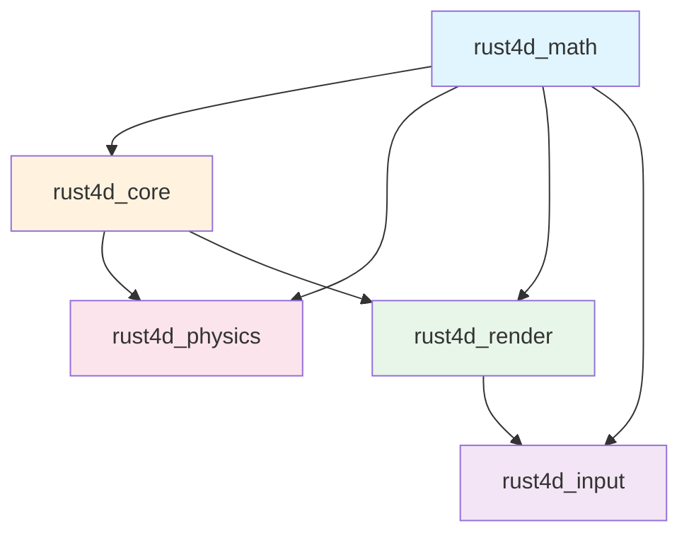
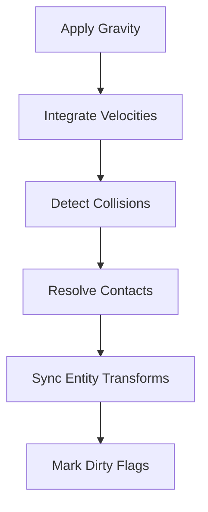
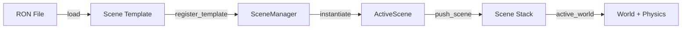
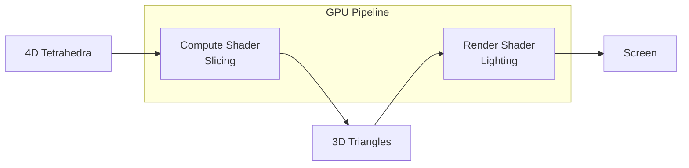

# Rust4D User Guide

This comprehensive guide covers all aspects of using the Rust4D 4D rendering engine. It assumes you have completed the Getting Started guide and have a working Rust4D installation.

## Table of Contents

- [Introduction](#introduction)
- [Understanding 4D Space](#understanding-4d-space)
  - [Coordinate Systems](#coordinate-systems)
  - [4D Rotations](#4d-rotations)
  - [Common 4D Shapes](#common-4d-shapes)
- [Core Concepts](#core-concepts)
  - [World](#world)
  - [Entity](#entity)
  - [Transform4D](#transform4d)
  - [Material](#material)
- [Creating Entities](#creating-entities)
  - [Built-in Shapes](#built-in-shapes)
  - [Entity Lifecycle](#entity-lifecycle)
- [Physics System](#physics-system)
  - [Enabling Physics](#enabling-physics)
  - [RigidBody Properties](#rigidbody-properties)
  - [PhysicsMaterial](#physicsmaterial)
  - [Collision Detection](#collision-detection)
  - [Player Physics](#player-physics)
- [Camera and Navigation](#camera-and-navigation)
  - [Camera4D](#camera4d)
  - [CameraController](#cameracontroller)
  - [Slicing](#slicing)
- [Scene System](#scene-system)
  - [Scene Files (RON)](#scene-files-ron)
  - [SceneManager](#scenemanager)
  - [Configuration (TOML)](#configuration-toml)
- [Rendering](#rendering)
  - [How Rendering Works](#how-rendering-works)
  - [Lighting](#lighting)
  - [Performance Tips](#performance-tips)
- [API Quick Reference](#api-quick-reference)
  - [Key Types](#key-types)
  - [Common Patterns](#common-patterns)
- [Troubleshooting](#troubleshooting)

---

## Introduction

### Purpose of This Guide

This guide serves as a comprehensive reference for the Rust4D 4D rendering engine. It covers all public APIs, explains the mathematical foundations of 4D space, and provides practical code examples for common tasks.

### Prerequisites

Before using this guide, you should:

- Have Rust 1.70+ installed
- Have completed the Getting Started guide
- Be familiar with basic 3D graphics concepts
- Understand basic Rust programming

### How to Navigate This Document

This guide is organized from foundational concepts to advanced topics:

1. **Understanding 4D Space** - Mathematical foundations
2. **Core Concepts** - Essential types and patterns
3. **Creating Entities** - Working with shapes and transforms
4. **Physics System** - Collision and rigid body simulation
5. **Camera and Navigation** - Viewing and controlling the 4D world
6. **Scene System** - Loading and managing scenes
7. **Rendering** - GPU pipeline and visualization
8. **API Quick Reference** - Concise type and pattern summaries

### Crate Architecture

Rust4D is organized into five crates with clear dependencies:



| Crate | Purpose |
|-------|---------|
| `rust4d_math` | 4D vectors, rotors, matrices, shapes |
| `rust4d_core` | World, entities, transforms, scenes |
| `rust4d_physics` | Collision detection, rigid bodies |
| `rust4d_game` | Character controller, events, FSM, scene helpers |
| `rust4d_render` | GPU pipeline, camera, slicing |
| `rust4d_input` | Keyboard/mouse handling |

---

## Understanding 4D Space

### Coordinate Systems

Rust4D uses a right-handed coordinate system extended to four dimensions:

| Axis | Direction | Description |
|------|-----------|-------------|
| **X** | Right (+) / Left (-) | Horizontal axis |
| **Y** | Up (+) / Down (-) | Vertical axis (gravity acts on -Y) |
| **Z** | Backward (+) / Forward (-) | Depth axis (camera looks toward -Z) |
| **W** | Ana (+) / Kata (-) | Fourth spatial dimension |

The W axis represents the fourth spatial dimension. The terms "ana" and "kata" (from Greek, meaning "up along" and "down along") describe movement in the positive and negative W directions respectively.

```
         +Y (up)
          |
          |
          |_____ +X (right)
         /
        /
       +Z (backward)

    +W extends perpendicular to all three axes
    (cannot be visualized in 3D, but affects slicing)
```

#### Units and Scale

Rust4D uses arbitrary units. By convention:
- 1 unit = 1 meter for human-scale scenes
- Default gravity is -20 units/second^2 (slightly stronger than Earth for snappy gameplay)
- Default player radius is 0.5 units

### 4D Rotations

#### Why Rotations Are Different in 4D

In 3D, we rotate around axes (X, Y, Z). In 4D, rotations occur in planes. This is because:
- In 3D: 3 axes lead to 3 rotation axes
- In 4D: 4 axes lead to 6 rotation planes (each pair of axes defines a plane)

The six rotation planes in 4D are:

| Plane | Description | 3D Equivalent |
|-------|-------------|---------------|
| **XY** | Rotation between X and Y | Roll (around Z axis) |
| **XZ** | Rotation between X and Z | Yaw (around Y axis) |
| **YZ** | Rotation between Y and Z | Pitch (around X axis) |
| **XW** | Rotation between X and W | 4D-only: affects X and W |
| **YW** | Rotation between Y and W | 4D-only: affects Y and W |
| **ZW** | Rotation between Z and W | 4D-only: affects Z and W |

#### Rotor4 Representation

Rust4D uses rotors from geometric algebra to represent 4D rotations. A rotor has 8 components:
- 1 scalar component
- 6 bivector components (one for each rotation plane)
- 1 pseudoscalar component

```rust
use rust4d_math::{Rotor4, RotationPlane};
use std::f32::consts::FRAC_PI_4;

// Create a 45-degree rotation in the XY plane
let rotation = Rotor4::from_plane_angle(RotationPlane::XY, FRAC_PI_4);

// Compose rotations (order matters!)
let r1 = Rotor4::from_plane_angle(RotationPlane::XZ, 0.5);
let r2 = Rotor4::from_plane_angle(RotationPlane::YZ, 0.3);
let combined = r1.compose(&r2).normalize();

// Rotate a vector
use rust4d_math::Vec4;
let v = Vec4::new(1.0, 0.0, 0.0, 0.0);
let rotated = rotation.rotate(v);
```

#### Common Rotation Operations

```rust
use rust4d_math::{Rotor4, RotationPlane};

// Identity (no rotation)
let identity = Rotor4::IDENTITY;

// Create from Euler angles (3D-compatible)
let euler = Rotor4::from_euler_xyz(pitch, yaw, roll);

// Create from two vectors defining the rotation plane
let plane_rotation = Rotor4::from_plane_vectors(
    Vec4::X,  // from direction
    Vec4::Z,  // toward direction
    angle
);

// Get the reverse (inverse for unit rotors)
let inverse = rotation.reverse();

// Convert to 4x4 matrix for GPU
let matrix: [[f32; 4]; 4] = rotation.to_matrix();
```

### Common 4D Shapes

#### Tesseract (Hypercube)

A tesseract is the 4D analog of a cube. Just as a cube has 6 square faces, a tesseract has 8 cubic cells.

```rust
use rust4d_math::Tesseract;
use rust4d_core::Tesseract4D;

// Create a tesseract with edge length 2.0
let tesseract = Tesseract4D::new(2.0);

// Properties:
// - 16 vertices
// - 32 edges
// - 24 square faces
// - 8 cubic cells
```

When the camera slices through a tesseract at W=0, it appears as a 3D cube (or more complex polyhedra at other W positions).

#### Hyperplane (Infinite Floor)

A hyperplane is an infinite 3D surface embedded in 4D space. It serves as floors, walls, and boundaries.

```rust
use rust4d_core::Hyperplane4D;

// Create a floor plane at Y = -2
// Parameters: size (visual extent), subdivisions, cell_size, thickness
let floor = Hyperplane4D::new(
    15.0,   // Visual size (15 units in each direction)
    10,     // Subdivision count for rendering
    2.0,    // Cell size for texture/pattern
    0.001   // Thickness (for rendering)
);
```

For physics, hyperplanes are represented separately as collision primitives.

#### How Shapes Appear When Sliced

For a complete catalog of built-in 4D shapes and their slice behavior, see the
[Shape Catalog](./shapes.md).

The camera views 4D space by taking a 3D cross-section (slice) at a specific W coordinate. What you see depends on:

1. **Object's W position** relative to slice W
2. **Object's W extent** (how "thick" it is in W)

| Scenario | What You See |
|----------|--------------|
| Object entirely above slice W | Nothing (invisible) |
| Object intersects slice W | 3D cross-section |
| Object entirely below slice W | Nothing (invisible) |

For a tesseract centered at W=0 with half-extent 1:
- At slice W=0: Full cube cross-section
- At slice W=0.5: Smaller cube
- At slice W=1.0: Single point (vertex)
- At slice W>1.0: Nothing

---

## Core Concepts

### World

The `World` is the container for all entities in a scene. It manages entity storage, physics integration, and provides iteration facilities.

```rust
use rust4d_core::{World, PhysicsConfig};

// Create an empty world
let mut world = World::new();

// Create a world with physics enabled
let config = PhysicsConfig::new(-20.0); // gravity
let mut world_with_physics = World::new().with_physics(config);
```

#### World Methods

```rust
// Add an entity, returns its key
let key = world.add_entity(entity);

// Get entity by key
if let Some(entity) = world.get(key) {
    println!("Entity: {:?}", entity.name());
}

// Get mutable entity
if let Some(entity) = world.get_mut(key) {
    entity.transform.position.y += 1.0;
}

// Remove entity
let removed = world.remove(key);

// Query by name
if let Some((key, _entity)) = world.get_by_name("player") {
    // ...
}

// Query by tag
for (_key, entity) in world.get_by_tag("dynamic") {
    // Process all entities tagged "dynamic"
}

// Iterate all entities
for entity in world.iter() {
    // Process each entity
}

// Update physics and sync transforms (call each frame)
world.update(delta_time);

// Check if any entities changed (for geometry rebuild)
if world.has_dirty_entities() {
    // Rebuild GPU geometry
    world.clear_all_dirty();
}
```

#### Physics Access

```rust
// Get physics world reference
if let Some(physics) = world.physics() {
    let body_count = physics.body_count();
}

// Get mutable physics world
if let Some(physics) = world.physics_mut() {
    let body_key = physics.add_body(rigid_body);
}
```

### Entity

An `Entity` represents a single object in the world with shape, transform, material, and optional physics.

```rust
use rust4d_core::{Entity, Material, ShapeRef, Tesseract4D, Transform4D};
use rust4d_math::Vec4;

// Create a basic entity
let tesseract = Tesseract4D::new(2.0);
let entity = Entity::new(ShapeRef::shared(tesseract));

// Create with material
let colored_entity = Entity::with_material(
    ShapeRef::shared(tesseract),
    Material::from_rgb(0.8, 0.4, 0.2)
);

// Create with full transform
let transform = Transform4D::from_position(Vec4::new(5.0, 0.0, 0.0, 0.0));
let positioned_entity = Entity::with_transform(
    ShapeRef::shared(tesseract),
    transform,
    Material::WHITE
);
```

#### Entity Properties

```rust
// Set name (for lookup)
let entity = entity.with_name("my_tesseract");

// Add tags for categorization
let entity = entity.with_tag("dynamic");
let entity = entity.with_tags(&["dynamic", "player", "visible"]);

// Check tags
if entity.has_tag("dynamic") {
    // ...
}

// Associate with physics body
let entity = entity.with_physics_body(body_key);
```

#### Entity Lifecycle

1. **Creation**: Build entity with shape, transform, material
2. **Registration**: Add to world with `world.add_entity()`
3. **Updates**: Modify transform, sync from physics
4. **Dirty tracking**: Entity marked dirty when transform changes
5. **Removal**: Remove from world with `world.remove(key)`

### Transform4D

`Transform4D` represents position, rotation, and scale in 4D space.

```rust
use rust4d_core::Transform4D;
use rust4d_math::{Vec4, Rotor4, RotationPlane};

// Identity transform (origin, no rotation, scale 1)
let identity = Transform4D::default();

// Position only
let positioned = Transform4D::from_position(Vec4::new(5.0, 0.0, -3.0, 2.0));

// Full transform
let transform = Transform4D {
    position: Vec4::new(1.0, 2.0, 3.0, 0.0),
    rotation: Rotor4::from_plane_angle(RotationPlane::XY, 0.5),
    scale: 2.0,
};
```

#### Transform Methods

```rust
// Get the transformation matrix
let matrix = transform.to_matrix();

// Transform a point
let local_point = Vec4::new(1.0, 0.0, 0.0, 0.0);
let world_point = transform.transform_point(local_point);

// Transform a direction (ignores position)
let world_direction = transform.transform_direction(local_point);
```

### Material

`Material` defines the visual appearance of an entity.

```rust
use rust4d_core::Material;

// Predefined colors
let white = Material::WHITE;
let gray = Material::GRAY;
let black = Material::BLACK;
let red = Material::RED;
let green = Material::GREEN;
let blue = Material::BLUE;

// Custom RGB (0.0-1.0 range)
let orange = Material::from_rgb(1.0, 0.5, 0.0);

// Custom RGBA
let transparent_blue = Material::from_rgba(0.0, 0.0, 1.0, 0.5);

// Direct construction
let material = Material {
    base_color: [0.8, 0.4, 0.2, 1.0],
};
```

---

## Creating Entities

### Built-in Shapes

Rust4D now ships a full primitive catalog: tesseract, hypersphere,
pentachoron (5-cell), hexadecachoron (16-cell), icositetrachoron (24-cell),
hexacosichoron (600-cell), spherinder, cubinder, and duocylinder. See the
[Shape Catalog](./shapes.md) for construction math, RON snippets, cell counts,
and visual verification notes for every primitive.

#### Tesseract

The tesseract (hypercube) is the primary 4D shape:

```rust
use rust4d_core::{Tesseract4D, Entity, ShapeRef, Material, Transform4D};
use rust4d_math::Vec4;

// Create a tesseract with edge length 2.0
let tesseract = Tesseract4D::new(2.0);

// Wrap in ShapeRef for sharing
let shape = ShapeRef::shared(tesseract);

// Create entity at origin
let entity = Entity::with_material(shape.clone(), Material::WHITE);

// Create entity at specific position
let transform = Transform4D::from_position(Vec4::new(5.0, 0.0, 0.0, 0.0));
let positioned = Entity::with_transform(
    shape,
    transform,
    Material::from_rgb(0.9, 0.3, 0.2)
);
```

See: `examples/01_hello_tesseract.rs`

#### Hyperplane

For floor surfaces and infinite boundaries:

```rust
use rust4d_core::{Hyperplane4D, Entity, ShapeRef, Material, Transform4D};
use rust4d_math::Vec4;

// Create floor geometry
// Parameters: size, subdivisions, cell_size, thickness
let floor_shape = Hyperplane4D::new(
    20.0,  // 20 units in each direction
    12,    // 12x12 subdivisions for smooth rendering
    2.0,   // 2-unit cells for patterns
    0.001  // Minimal thickness
);

// Position at Y = -2 (shape is created at y=0 in local space)
let transform = Transform4D::from_position(Vec4::new(0.0, -2.0, 0.0, 0.0));

let floor = Entity::with_transform(
    ShapeRef::shared(floor_shape),
    transform,
    Material::GRAY
).with_name("floor")
 .with_tag("static");
```

Note: The visual `Hyperplane4D` shape is separate from the physics `StaticCollider`. You need both for a functional floor.

#### ShapeTemplate (Serialization)

For scene files, shapes are described using `ShapeTemplate`:

```rust
// In RON scene files
ShapeTemplate(
    type: "Tesseract",
    size: 2.0,
)

ShapeTemplate(
    type: "Hyperplane",
    y: -2.0,
    size: 10.0,
    subdivisions: 10,
    cell_size: 5.0,
    thickness: 0.001,
)
```

### Entity Lifecycle

#### Creating Entities

```rust
use rust4d_core::{Entity, World, Tesseract4D, ShapeRef, Material};

let mut world = World::new();

// Method 1: Basic creation
let entity = Entity::new(ShapeRef::shared(Tesseract4D::new(2.0)));
let key = world.add_entity(entity);

// Method 2: Builder pattern
let entity = Entity::with_material(
    ShapeRef::shared(Tesseract4D::new(1.5)),
    Material::RED
)
.with_name("red_cube")
.with_tag("dynamic");
let key = world.add_entity(entity);
```

#### Modifying Transforms

```rust
// Get mutable reference
if let Some(entity) = world.get_mut(key) {
    // Modify transform
    entity.transform.position.y += 1.0;
    entity.transform.scale = 2.0;

    // Entity is automatically marked dirty
}

// After physics update, transforms sync automatically
world.update(delta_time);
```

#### Removing Entities

```rust
// Remove by key
if let Some(removed) = world.remove(key) {
    println!("Removed entity: {:?}", removed.name());
}

// Note: Associated physics bodies must be removed separately
if let Some(body_key) = entity.physics_body() {
    if let Some(physics) = world.physics_mut() {
        physics.remove_body(body_key);
    }
}
```

#### Dirty Tracking

Entities are marked "dirty" when their transform changes. This allows efficient geometry updates:

```rust
// Check if any entities changed
if world.has_dirty_entities() {
    // Rebuild GPU geometry only when needed
    let geometry = RenderableGeometry::from_world(&world);

    // Upload to GPU...

    // Clear dirty flags
    world.clear_all_dirty();
}
```

---

## Physics System

### Enabling Physics

Physics is an optional system. Enable it when creating the world:

```rust
use rust4d_core::{World, PhysicsConfig};

// Create physics configuration
let config = PhysicsConfig::new(-20.0); // Gravity: -20 units/s^2 on Y axis

// Create world with physics
let mut world = World::new().with_physics(config);
```

#### PhysicsConfig

```rust
use rust4d_core::PhysicsConfig;

// Default: gravity = -20.0
let default_config = PhysicsConfig::default();

// Custom gravity
let lunar_gravity = PhysicsConfig::new(-1.62);

// Zero gravity
let space = PhysicsConfig::new(0.0);
```

#### World Physics Integration

```rust
// Step physics and sync transforms (call each frame)
world.update(delta_time);

// Access physics world
if let Some(physics) = world.physics_mut() {
    // Add static colliders
    physics.add_static_collider(floor_collider);

    // Add dynamic bodies
    let body_key = physics.add_body(rigid_body);

    // Generic body operations (use BodyKey from add_body)
    physics.apply_body_movement(body_key, movement_vec);
    physics.body_jump(body_key, jump_velocity);
    let grounded = physics.body_is_grounded(body_key);
    let position = physics.body_position(body_key);
}

// For player characters, use CharacterController4D (from rust4d_game)
// which wraps a BodyKey and provides high-level movement operations.
// See the Player Physics section below.
```

#### Physics Update Cycle

Each frame, `world.update(dt)` performs:



### RigidBody Properties

#### Creating Rigid Bodies

```rust
use rust4d_physics::{RigidBody4D, BodyType, PhysicsMaterial};
use rust4d_math::Vec4;

// Sphere collider (radius-based)
let sphere = RigidBody4D::new_sphere(
    Vec4::new(0.0, 5.0, 0.0, 0.0), // position
    0.5                             // radius
);

// AABB collider (box-based)
let aabb = RigidBody4D::new_aabb(
    Vec4::new(0.0, 5.0, 0.0, 0.0),       // position
    Vec4::new(1.0, 1.0, 1.0, 1.0)        // half-extents
);

// Static AABB (doesn't move)
let static_box = RigidBody4D::new_static_aabb(
    Vec4::ZERO,
    Vec4::new(2.0, 0.5, 2.0, 2.0)
);
```

#### Body Types

| Type | Description | Use Case |
|------|-------------|----------|
| `Dynamic` | Full physics simulation | Falling objects, projectiles |
| `Static` | Never moves, infinite mass | Floors, walls, platforms |
| `Kinematic` | User-controlled velocity (gravity opt-in) | Player characters |

```rust
use rust4d_physics::BodyType;

let body = RigidBody4D::new_sphere(position, 0.5)
    .with_body_type(BodyType::Kinematic);
```

#### Body Builder Methods

```rust
let body = RigidBody4D::new_sphere(position, 0.5)
    .with_velocity(Vec4::new(5.0, 0.0, 0.0, 0.0))
    .with_mass(10.0)
    .with_body_type(BodyType::Dynamic)
    .with_material(PhysicsMaterial::RUBBER)
    .with_restitution(0.8);  // Shorthand for bounciness
```

### PhysicsMaterial

Physics materials define collision response properties:

```rust
use rust4d_physics::PhysicsMaterial;

// Predefined materials
let ice = PhysicsMaterial::ICE;         // Low friction, slight bounce
let rubber = PhysicsMaterial::RUBBER;   // High friction, very bouncy
let metal = PhysicsMaterial::METAL;     // Moderate friction and bounce
let wood = PhysicsMaterial::WOOD;       // Moderate friction, low bounce
let concrete = PhysicsMaterial::CONCRETE; // High friction, low bounce

// Custom material
let custom = PhysicsMaterial::new(
    0.5,  // friction (0.0 = ice, 1.0 = rubber)
    0.3   // restitution (0.0 = no bounce, 1.0 = perfect bounce)
);
```

#### Material Properties

| Property | Range | Description |
|----------|-------|-------------|
| `friction` | 0.0-1.0 | How much objects resist sliding |
| `restitution` | 0.0-1.0 | How bouncy collisions are |

When two materials collide:
- **Friction**: Geometric mean (models surface interaction)
- **Restitution**: Maximum (bouncier surface wins)

```rust
let combined = material_a.combine(&material_b);
```

### Collision Detection

#### Supported Collider Shapes

| Shape | Description |
|-------|-------------|
| `Sphere4D` | 4D sphere (center + radius) |
| `AABB4D` | Axis-aligned bounding box |
| `Plane4D` | Infinite hyperplane |

#### Static Colliders

For floors, walls, and immovable surfaces:

```rust
use rust4d_physics::{StaticCollider, PhysicsMaterial};
use rust4d_math::Vec4;

// Infinite floor plane at Y = -2
let floor = StaticCollider::floor(-2.0, PhysicsMaterial::CONCRETE);

// Bounded floor (can fall off edges)
let platform = StaticCollider::floor_bounded(
    0.0,   // Y height of surface
    10.0,  // Half-size in X and Z
    5.0,   // Half-size in W
    5.0,   // Thickness (for tunneling prevention)
    PhysicsMaterial::CONCRETE
);

// Custom plane (e.g., wall)
let wall = StaticCollider::plane(
    Vec4::new(1.0, 0.0, 0.0, 0.0), // Normal
    5.0,                            // Distance from origin
    PhysicsMaterial::METAL
);

// Add to physics world
physics_world.add_static_collider(floor);
```

#### Collision Layers

Filter which objects can collide:

```rust
use rust4d_physics::{CollisionFilter, CollisionLayer};

// Predefined filters
let player_filter = CollisionFilter::player();
let enemy_filter = CollisionFilter::enemy();
let static_filter = CollisionFilter::static_world();
let trigger_filter = CollisionFilter::trigger(CollisionLayer::PLAYER);
let projectile_filter = CollisionFilter::player_projectile();

// Custom filter
let custom = CollisionFilter::new(
    CollisionLayer::PLAYER,      // This object's layer
    CollisionLayer::ALL          // Collides with these layers
        & !CollisionLayer::TRIGGER
);

// Apply to body
let body = RigidBody4D::new_sphere(pos, 0.5)
    .with_filter(player_filter);
```

#### Collision Response

The physics system automatically handles:
1. **Penetration resolution**: Pushes overlapping bodies apart
2. **Velocity response**: Applies bounce based on restitution
3. **Friction**: Slows tangential velocity on contact
4. **Grounding detection**: Tracks when bodies touch floors

### Player Physics

Player movement uses `CharacterController4D` from `rust4d_game`, which wraps a generic physics body and provides high-level FPS-style controls:

```rust
use rust4d_game::{CharacterController4D, CharacterConfig, scene_helpers};
use rust4d_physics::{PhysicsWorld, BodyType};
use rust4d_math::Vec4;

// Create player body via scene_helpers (the canonical way)
let spawn = Vec4::new(0.0, 1.0, 0.0, 0.0);
let player_key = scene_helpers::create_player_body(&mut physics, spawn, 0.5);

// Create character controller wrapping the body key
let controller = CharacterController4D::new(player_key, CharacterConfig {
    move_speed: 5.0,
    w_move_speed: 5.0,
    jump_velocity: 8.0,
});
```

#### Player Movement

```rust
// Apply horizontal movement (preserves Y velocity for gravity)
let movement = Vec4::new(
    forward_speed, // X
    0.0,           // Y ignored
    strafe_speed,  // Z
    w_speed        // W for 4D movement
);
controller.apply_movement(&mut physics, movement);

// Jump (only succeeds if grounded)
if input.jump_pressed {
    controller.jump(&mut physics);
}

// Check state
let grounded = controller.is_grounded(&physics);
let position = controller.position(&physics);
```

---

## Camera and Navigation

### Camera4D

The `Camera4D` provides a 4D viewpoint with FPS-style controls:

```rust
use rust4d_render::camera4d::Camera4D;
use rust4d_math::Vec4;

// Create camera at default position
let mut camera = Camera4D::new();

// Set position (x, y, z, w)
camera.position = Vec4::new(0.0, 2.0, 10.0, 0.0);

// Get slice W coordinate
let slice_w = camera.get_slice_w();
```

#### Camera Properties

| Property | Description |
|----------|-------------|
| `position` | 4D position (x, y, z, w) |
| `pitch` | Vertical look angle (clamped to +/-89 degrees) |
| `rotation_4d` | 4D rotation rotor (affects XZW only, preserves Y) |
| `slice_offset` | Offset from camera W for slicing |

#### Camera Methods

```rust
// Movement (camera-relative)
camera.move_local_xz(forward, right);  // XZ plane movement
camera.move_y(delta);                   // Vertical movement
camera.move_w(delta);                   // 4D movement

// Rotation
camera.rotate_3d(yaw, pitch);  // Standard FPS look
camera.rotate_w(delta);        // 4D rotation (ZW plane)
camera.rotate_xw(delta);       // 4D rotation (XW plane)

// Direction vectors
let forward = camera.forward();  // -Z in camera space
let right = camera.right();      // +X in camera space
let up = camera.up();            // +Y in camera space
let ana = camera.ana();          // +W in camera space

// Reset to default
camera.reset();
```

#### Slice Control

```rust
// Adjust slice offset
camera.adjust_slice_offset(delta);

// Get effective slice W (position.w + slice_offset)
let slice_w = camera.get_slice_w();
```

### CameraController

The `CameraController` translates input into camera commands:

```rust
use rust4d_input::CameraController;

let mut controller = CameraController::new()
    .with_move_speed(5.0)
    .with_w_move_speed(3.0)
    .with_mouse_sensitivity(0.002)
    .with_smoothing(false);
```

#### Input Processing

```rust
// Process keyboard (returns true if handled)
let handled = controller.process_keyboard(key_code, state);

// Process mouse buttons
controller.process_mouse_button(button, state);

// Process mouse motion
controller.process_mouse_motion(delta_x, delta_y);

// Update camera each frame
controller.update(&mut camera, delta_time, cursor_captured);
```

#### Movement State

```rust
// Check if moving
let is_moving = controller.is_moving();

// Get raw movement input
let (forward, right) = controller.get_movement_input();
let w_input = controller.get_w_input();

// Consume jump input (for physics mode)
if controller.consume_jump() {
    // Handle jump
}
```

#### Control Reference

| Input | Action |
|-------|--------|
| W/S | Forward/backward |
| A/D | Left/right strafe |
| Q/E | Ana/kata (W-axis movement) |
| Space | Up (or jump in physics mode) |
| Shift | Down |
| Mouse | Look (when captured) |
| Right-click + drag | 4D rotation |

See: `examples/04_camera_exploration.rs`

### Slicing

The camera slices 4D space to produce a 3D view. The slice position is determined by:

```
slice_w = camera.position.w + camera.slice_offset
```

#### How Slicing Works

1. All 4D geometry is tessellated into tetrahedra (4D simplices)
2. The GPU compute shader intersects each tetrahedron with a 3D hyperplane at `slice_w`
3. Intersections produce 3D triangles (or nothing if no intersection)
4. These triangles are rendered normally

#### W-Position Effects

Objects at different W positions appear differently:

| Object W vs Slice W | Effect |
|---------------------|--------|
| Object W == Slice W | Full cross-section visible |
| Object W near Slice W | Partial cross-section (smaller) |
| Object W far from Slice W | Not visible (no intersection) |

Moving in W (Q/E keys) is like moving through "layers" of 4D space.

---

## Scene System

The scene system manages loading, instantiation, and switching between scenes.



### Scene Files (RON)

Scenes are defined in RON (Rusty Object Notation) files. The default scene is at `scenes/default.ron`.

#### Scene Structure

```ron
Scene(
    name: "My Scene",
    entities: [
        EntityTemplate(
            name: Some("floor"),
            tags: ["static"],
            transform: Transform4D(
                position: Vec4(x: 0.0, y: -2.0, z: 0.0, w: 0.0),
                rotation: (1.0, 0.0, 0.0, 0.0, 0.0, 0.0, 0.0, 0.0),
                scale: 1.0,
            ),
            shape: ShapeTemplate(
                type: "Hyperplane",
                y: -2.0,
                size: 10.0,
                subdivisions: 10,
                cell_size: 5.0,
                thickness: 0.001,
            ),
            material: Material(base_color: (0.5, 0.5, 0.5, 1.0)),
        ),
        EntityTemplate(
            name: Some("tesseract"),
            tags: ["dynamic"],
            transform: Transform4D(
                position: Vec4(x: 0.0, y: 0.0, z: 0.0, w: 0.0),
                rotation: (1.0, 0.0, 0.0, 0.0, 0.0, 0.0, 0.0, 0.0),
                scale: 1.0,
            ),
            shape: ShapeTemplate(
                type: "Tesseract",
                size: 2.0,
            ),
            material: Material(base_color: (1.0, 1.0, 1.0, 1.0)),
        ),
    ],
    gravity: Some(-20.0),
    player_spawn: Some((0.0, 0.0, 5.0, 0.0)),
)
```

#### EntityTemplate Fields

| Field | Type | Description |
|-------|------|-------------|
| `name` | `Option<String>` | Entity name for lookup |
| `tags` | `[String]` | Tags for categorization |
| `transform` | `Transform4D` | Position, rotation, scale |
| `shape` | `ShapeTemplate` | Shape definition |
| `material` | `Material` | Visual appearance |

#### ShapeTemplate Types

**Tesseract:**
```ron
ShapeTemplate(
    type: "Tesseract",
    size: 2.0,  // Edge length
)
```

**Hyperplane:**
```ron
ShapeTemplate(
    type: "Hyperplane",
    y: -2.0,         // Y position for physics
    size: 10.0,      // Visual extent
    subdivisions: 10, // Mesh detail
    cell_size: 5.0,   // Pattern size
    thickness: 0.001, // Render thickness
)
```

### SceneManager

The `SceneManager` handles loading, unloading, and switching scenes:

```rust
use rust4d_core::{SceneManager, Scene};

// Create manager
let mut scene_manager = SceneManager::new();

// Load scene from file
let scene_data = std::fs::read_to_string("scenes/default.ron")?;
let scene: Scene = ron::from_str(&scene_data)?;

// Register scene template
scene_manager.register_template(scene);

// Instantiate scene (creates runtime ActiveScene from template)
scene_manager.instantiate("Default Scene")?;

// Push scene onto the active stack
scene_manager.push_scene("Default Scene")?;

// Switch to a different scene (replaces top of stack)
scene_manager.switch_to("Other Scene")?;

// Pop overlay scene from stack
scene_manager.pop_scene();
```

#### Scene Stack

The SceneManager supports a scene stack for overlays:

```
Top:    pause_menu (receives input)
        game (paused)
Bottom: (none - cleared when switching)
```

### Configuration (TOML)

Configuration uses a layered TOML system. The default configuration is at `config/default.toml`.

#### Configuration Structure

```toml
[window]
title = "Rust4D - 4D Rendering Engine"
width = 1280
height = 720
fullscreen = false
vsync = true

[camera]
start_position = [0.0, 0.0, 5.0, 0.0]
fov = 45.0
near = 0.1
far = 100.0
pitch_limit = 89.0

[input]
move_speed = 3.0
w_move_speed = 2.0
mouse_sensitivity = 0.002
w_rotation_sensitivity = 0.005
smoothing_half_life = 0.05
smoothing_enabled = false

[physics]
gravity = -20.0
jump_velocity = 8.0

[rendering]
max_triangles = 1000000
background_color = [0.02, 0.02, 0.08, 1.0]
light_dir = [0.5, 1.0, 0.3]
ambient_strength = 0.3
diffuse_strength = 0.7

[debug]
show_overlay = false
log_level = "info"
show_colliders = false

[scene]
path = "scenes/test_chamber.ron"
player_radius = 0.5
```

#### User Overrides

Create `config/user.toml` (gitignored) to override defaults:

```toml
[input]
move_speed = 10.0
mouse_sensitivity = 0.004

[debug]
show_overlay = true
```

#### Environment Variables

Override any setting with environment variables using `R4D_SECTION__KEY` format:

```bash
R4D_INPUT__MOVE_SPEED=10.0 cargo run
R4D_DEBUG__SHOW_OVERLAY=true cargo run
```

Priority: Environment > user.toml > default.toml

---

## Rendering

### How Rendering Works

Rust4D uses a two-pass GPU pipeline to render 4D geometry:



#### Pass 1: Slicing (Compute Shader)

1. Input: 4D vertices organized into tetrahedra (5 vertices each)
2. Each tetrahedron is intersected with the slice hyperplane at `slice_w`
3. Intersection produces 0, 3, or 4 vertices (nothing, triangle, or quad)
4. Output: 3D triangles with position, normal, and color

#### Pass 2: Rendering (Fragment Shader)

1. Input: 3D triangles from slicing pass
2. Standard vertex transformation (view + projection matrices)
3. Fragment shading with lighting and W-depth coloring
4. Output: Final frame

#### Marching Tetrahedra Algorithm

The slicing algorithm is similar to marching cubes, but operates on tetrahedra:

1. For each tetrahedron vertex, compute signed distance to slice hyperplane
2. Classify each vertex as above (+) or below (-) the hyperplane
3. Find edge intersections where sign changes
4. Connect intersections to form triangles

### Lighting

Lighting uses a simple directional light model:

```rust
use rust4d_render::pipeline::RenderUniforms;

let uniforms = RenderUniforms {
    // ... view/projection matrices ...

    light_dir: [0.5, 1.0, 0.3],     // Light direction (normalized in shader)
    ambient_strength: 0.3,          // Base lighting (0.0-1.0)
    diffuse_strength: 0.7,          // Directional lighting (0.0-1.0)
    w_color_strength: 0.5,          // W-depth coloring intensity
    w_range: 2.0,                   // W range for color mapping
    // ...
};
```

#### Lighting Components

| Component | Description |
|-----------|-------------|
| Ambient | Constant base illumination |
| Diffuse | Directional light based on surface normal |
| W-depth | Color tint based on original W coordinate |

#### W-Depth Coloring

Objects are tinted based on their original W position before slicing:
- W > 0: Blue tint (approaching from ana)
- W < 0: Red tint (approaching from kata)
- W = 0: No tint

This helps visualize the fourth dimension.

### Performance Tips

#### Entity Count

The primary performance factor is the number of tetrahedra processed:
- Each tesseract generates ~384 tetrahedra
- Each hyperplane cell generates ~24 tetrahedra
- More entities = more tetrahedra = slower rendering

Recommendations:
- Keep total tetrahedra under 100,000 for 60 FPS
- Use lower subdivision counts for distant objects
- Cull entities far from the camera

#### Geometry Complexity

Reduce complexity by:
- Using smaller `subdivisions` for hyperplanes
- Reducing tesseract size doesn't affect tetrahedron count
- Combining multiple small shapes into fewer entities

#### GPU Requirements

Rust4D requires:
- wgpu-compatible GPU (Vulkan, Metal, or DX12)
- Compute shader support
- At least 2GB VRAM recommended

Monitor with:
```toml
[debug]
log_level = "debug"
```

#### Dirty Tracking

Only rebuild GPU geometry when entities change:

```rust
// Efficient: Only rebuild when needed
if world.has_dirty_entities() {
    geometry = RenderableGeometry::from_world(&world);
    slice_pipeline.upload_tetrahedra(&device, &geometry.vertices, &geometry.tetrahedra);
    world.clear_all_dirty();
}

// Inefficient: Rebuild every frame
// geometry = RenderableGeometry::from_world(&world);  // Don't do this!
```

---

## API Quick Reference

### Key Types

#### Math Types (`rust4d_math`)

| Type | Description |
|------|-------------|
| `Vec4` | 4D vector with x, y, z, w components |
| `Rotor4` | 4D rotation (8 components) |
| `RotationPlane` | Enum of 6 rotation planes |
| `mat4` | 4x4 matrix operations module |

#### Core Types (`rust4d_core`)

| Type | Description |
|------|-------------|
| `World` | Container for all entities |
| `Entity` | Single object with shape/transform/material |
| `EntityKey` | Handle to an entity in World |
| `Transform4D` | Position, rotation, scale |
| `Material` | Visual appearance (color) |
| `Tesseract4D` | 4D hypercube shape |
| `Hyperplane4D` | Infinite floor/wall shape |
| `ShapeRef` | Shared reference to shape |
| `Scene` | Loadable scene definition |
| `SceneManager` | Scene loading and switching |

#### Physics Types (`rust4d_physics`)

| Type | Description |
|------|-------------|
| `PhysicsWorld` | Physics simulation container |
| `RigidBody4D` | Dynamic physics body |
| `BodyKey` | Handle to a body in PhysicsWorld |
| `BodyType` | Dynamic, Static, or Kinematic |
| `StaticCollider` | Immovable collision surface |
| `PhysicsMaterial` | Friction and restitution |
| `CollisionFilter` | Layer/mask collision filtering |
| `CollisionLayer` | Bit flags for collision groups |
| `Collider` | Sphere, AABB, or Plane shape |

#### Render Types (`rust4d_render`)

| Type | Description |
|------|-------------|
| `Camera4D` | 4D camera with position/rotation |
| `RenderContext` | wgpu device/surface management |
| `SlicePipeline` | 4D-to-3D slicing compute shader |
| `RenderPipeline` | 3D triangle rendering |
| `RenderableGeometry` | CPU-side geometry for GPU upload |

#### Input Types (`rust4d_input`)

| Type | Description |
|------|-------------|
| `CameraController` | FPS-style camera controls |
| `CameraControl` | Trait for controllable cameras |

### Common Patterns

#### Creating a Basic Scene

```rust
use rust4d_core::{World, Entity, Material, ShapeRef, Tesseract4D, Transform4D};
use rust4d_math::Vec4;

fn create_scene() -> World {
    let mut world = World::new();

    // Create entities
    let tesseract = Tesseract4D::new(2.0);
    let entity = Entity::with_transform(
        ShapeRef::shared(tesseract),
        Transform4D::from_position(Vec4::ZERO),
        Material::WHITE
    ).with_name("main_cube");

    world.add_entity(entity);
    world
}
```

#### Adding Physics Entities

```rust
use rust4d_core::{World, Entity, ShapeRef, Tesseract4D, Transform4D, Material, PhysicsConfig};
use rust4d_physics::{RigidBody4D, BodyType, PhysicsMaterial, StaticCollider};
use rust4d_math::Vec4;

fn create_physics_scene() -> World {
    let config = PhysicsConfig::new(-20.0);
    let mut world = World::new().with_physics(config);

    // Add floor collider
    if let Some(physics) = world.physics_mut() {
        physics.add_static_collider(
            StaticCollider::floor(-2.0, PhysicsMaterial::CONCRETE)
        );
    }

    // Add falling tesseract with physics
    let position = Vec4::new(0.0, 5.0, 0.0, 0.0);
    let half_ext = Vec4::new(1.0, 1.0, 1.0, 1.0);

    let body_key = if let Some(physics) = world.physics_mut() {
        Some(physics.add_body(
            RigidBody4D::new_aabb(position, half_ext)
                .with_body_type(BodyType::Dynamic)
                .with_material(PhysicsMaterial::RUBBER)
        ))
    } else {
        None
    };

    let mut entity = Entity::with_transform(
        ShapeRef::shared(Tesseract4D::new(2.0)),
        Transform4D::from_position(position),
        Material::RED
    ).with_name("falling_cube")
     .with_tag("dynamic");

    if let Some(key) = body_key {
        entity = entity.with_physics_body(key);
    }

    world.add_entity(entity);
    world
}
```

#### Camera Setup

```rust
use rust4d_render::camera4d::Camera4D;
use rust4d_input::CameraController;
use rust4d_math::Vec4;

fn setup_camera() -> (Camera4D, CameraController) {
    let mut camera = Camera4D::new();
    camera.position = Vec4::new(0.0, 2.0, 10.0, 0.0);

    let controller = CameraController::new()
        .with_move_speed(5.0)
        .with_w_move_speed(3.0)
        .with_mouse_sensitivity(0.002);

    (camera, controller)
}
```

#### Scene Loading

```rust
use rust4d_core::{Scene, SceneManager};

fn load_scene(path: &str) -> Result<SceneManager, Box<dyn std::error::Error>> {
    let scene_data = std::fs::read_to_string(path)?;
    let scene: Scene = ron::from_str(&scene_data)?;

    let mut manager = SceneManager::new();
    manager.register_template(scene.clone());
    manager.instantiate(&scene.name)?;
    manager.push_scene(&scene.name)?;

    Ok(manager)
}
```

---

## Troubleshooting

### Common Errors

#### "Entity not found" when accessing by key

**Cause**: The entity was removed, or the key is from a different World.

**Solution**: Check if entity exists before accessing:
```rust
if let Some(entity) = world.get(key) {
    // Safe to use
}
```

#### Objects fall through floor

**Cause**: Missing static collider in physics world.

**Solution**: Add a static floor collider:
```rust
if let Some(physics) = world.physics_mut() {
    physics.add_static_collider(
        StaticCollider::floor(-2.0, PhysicsMaterial::CONCRETE)
    );
}
```

#### Nothing visible on screen

**Causes**:
1. Camera looking away from objects
2. Objects at different W position than camera slice
3. Objects too far from camera

**Solutions**:
1. Reset camera: `camera.reset()`
2. Move in W with Q/E keys
3. Check camera position vs object positions

#### Physics entities don't move

**Cause**: Entities have `BodyType::Static` or no gravity enabled.

**Solution**: Use `BodyType::Dynamic`:
```rust
let body = RigidBody4D::new_sphere(pos, 0.5)
    .with_body_type(BodyType::Dynamic);
```

### Performance Issues

#### Low framerate

**Diagnose**: Enable debug logging:
```toml
[debug]
log_level = "debug"
```

**Solutions**:
1. Reduce entity count
2. Lower hyperplane subdivisions
3. Check GPU memory usage
4. Ensure dirty tracking is working (not rebuilding every frame)

#### High GPU memory usage

**Cause**: Too many tetrahedra being processed.

**Solution**: Reduce geometric complexity:
- Fewer entities
- Lower subdivisions
- Smaller visual ranges for hyperplanes

### Rendering Artifacts

#### Z-fighting (flickering surfaces)

**Cause**: Objects at nearly identical positions.

**Solution**: Ensure minimum separation between surfaces, or adjust near/far planes:
```toml
[camera]
near = 0.1
far = 100.0
```

#### Objects disappearing at edges

**Cause**: Near/far plane clipping.

**Solution**: Adjust camera clipping planes or move camera closer.

#### Incorrect lighting

**Cause**: Normals pointing wrong direction or light direction not normalized.

**Solution**: The shader normalizes light direction automatically, but ensure:
- Light direction has non-zero length
- Ambient + diffuse strengths sum to reasonable value (0.8-1.2)

---

## See Also

- Examples: `examples/`
- Architecture: `ARCHITECTURE.md`
- Default Scene: `scenes/default.ron`
- Default Config: `config/default.toml`
